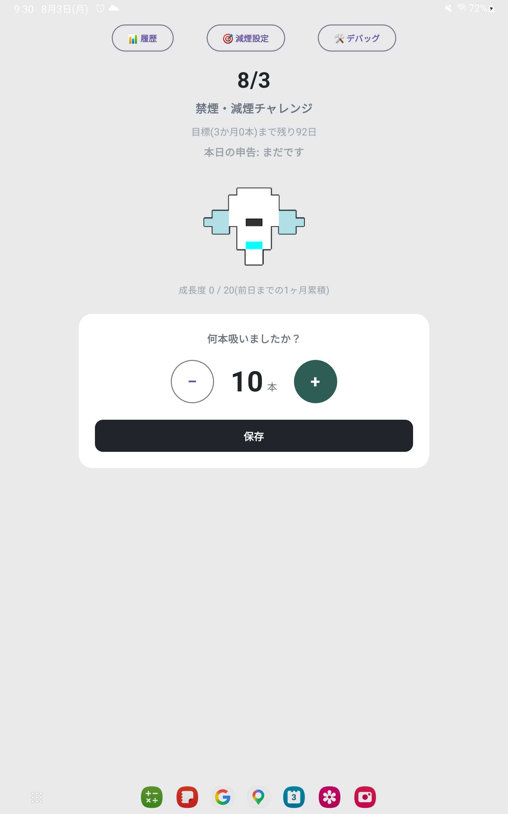
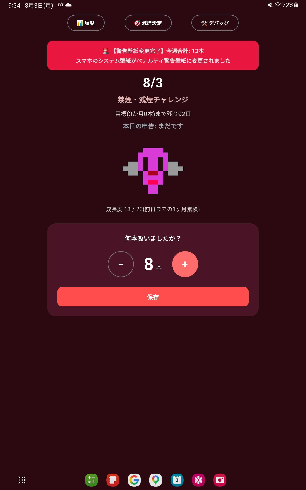
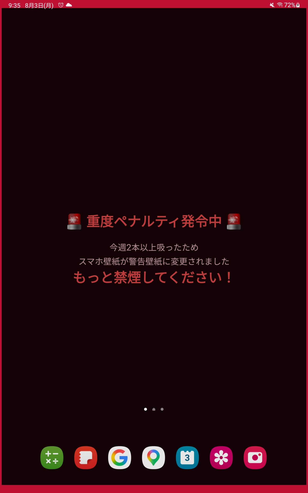
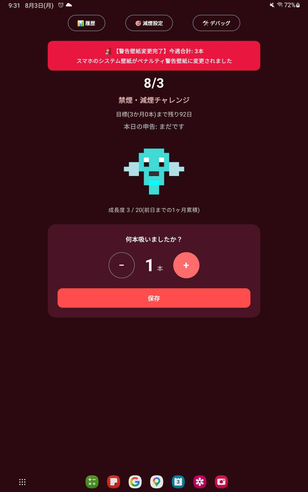
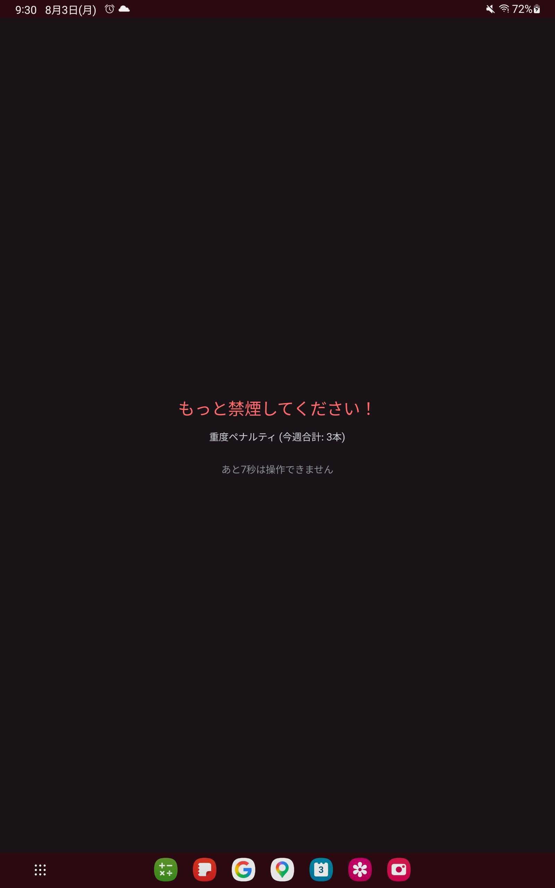
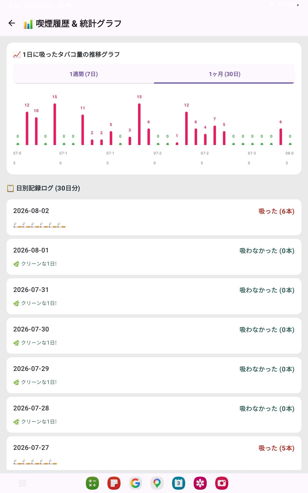
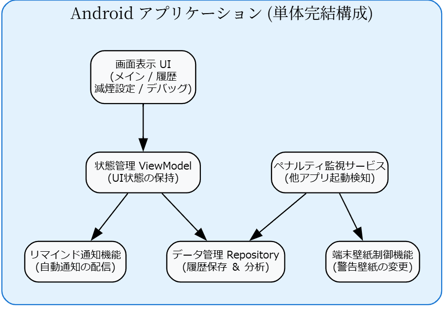

# チーム名

Yo Say 酒場

# プロダクト名

モグラの恩返し

## 概要

日別の喫煙本数を記録すると、過去データに基づく適切な初期値を提案し、1週間・1ヶ月の推移を直感的な可視化グラフで表示します。
目標達成が困難な場合でも、「段階的減煙モード」と「完全禁煙モード」の2つのモードで自身のペースに合わせた調整が可能です。
過度な喫煙時には、他アプリ起動時の60秒間操作ロックやスマホ端末壁紙の自動警告変更など、強固なペナルティ機能で減煙を強力に促します。

## デモ

- **発表資料URL**: [発表スライド資料 (HTML版)](presentation/interim_slides.html)

### 📸 アプリ実機スクリーンショット

| ホーム画面 (メイン) | 60秒操作ロックペナルティ | 🚨 端末壁紙警告自動変更 |
| :---: | :---: | :---: |
|  |  |  |

| 📊 履歴 (グラフ&ピクトグラム) | 🎯 目標設定 (減煙モード) | ⚙️ 設定・テスト通知 |
| :---: | :---: | :---: |
|  |  |  |

## システム構成



## 背景・課題

喫煙が長年の生活習慣として深く定着しているため、食後や仕事の合間といった特定のシチュエーションにおいて無意識に手が伸びてしまい、決意を維持できないこと。

## 主な機能

- 毎日の喫煙本数の入力・保存
- 喫煙履歴の推移グラフ表示
- 段階的な目標本数の自動計算・設定
- 過度な喫煙に対するペナルティ警告

## 工夫した点・こだわった点
- **回避不能なリアルタイムペナルティシステム（アイデア・技術面）**
  - 単なる通知にとどまらず、`UsageStatsManager` による他アプリ起動監視と `WindowManager` オーバーレイを組み合わせ、過度な喫煙時に60秒間逃れられない全画面操作ロックを実現しました。
  - ペナルティ終了タイムスタンプをローカルへ永続保存することで、アプリの再起動や画面遷移を行ってもロックが維持される強固な設計にこだわりました。
- **スマホ端末壁紙の自動警告変更（UX・インパクト面）**
  - 重度ペナルティ発火時、Android の `WallpaperManager` を介してスマホ本体のホーム画面・ロック画面壁紙を「🚨 危険警告壁紙」へ自動変更するインパクトのある罰則演出を組み込みました。
- **挫折を防ぐ柔軟な目標選定アルゴリズム（ロジック面）**
  - 過去4週間の喫煙傾向から入力初期値を自動算出し、「段階的減煙モード（今週平均÷1.5）」と「完全禁煙モード（常に0本）」の2つのモードで、ユーザーの状況に寄り添った目標調整を可能にしました。

## 使用技術

- **フロントエンド**： Kotlin, Jetpack Compose (Material3), ViewModel, StateFlow
- **バックエンド**： Python, FastAPI, Uvicorn
- **AI / API**： LM Studio API (HTTP REST)
- **データベース**： SQLite
- **インフラ**： ローカル開発環境 (Localhost / Android Emulator)
- **その他**： kotlinx.serialization, SharedPreferences, WindowManager, WallpaperManager, UsageStatsManager, AlarmManager, Gradle

## 今後の展望

タバコ以外にもお酒や睡眠まで健康的な生活を習慣化できるアプリにしたい。なおこれに縛られたものではない

## セットアップ方法

apkファイルをダウンロードし、Android端末にインストールしてください。

開発用

```bash
git clone https://github.com/Hackit-2026/Team20.git
cd Team20
cd AndroidApp
./gradlew assembleDebug

## メンバー

| 名前 |
|------|
|伊熊涼介|
|亀山龍牙|
|永井航太郎|
|市川寛人|
